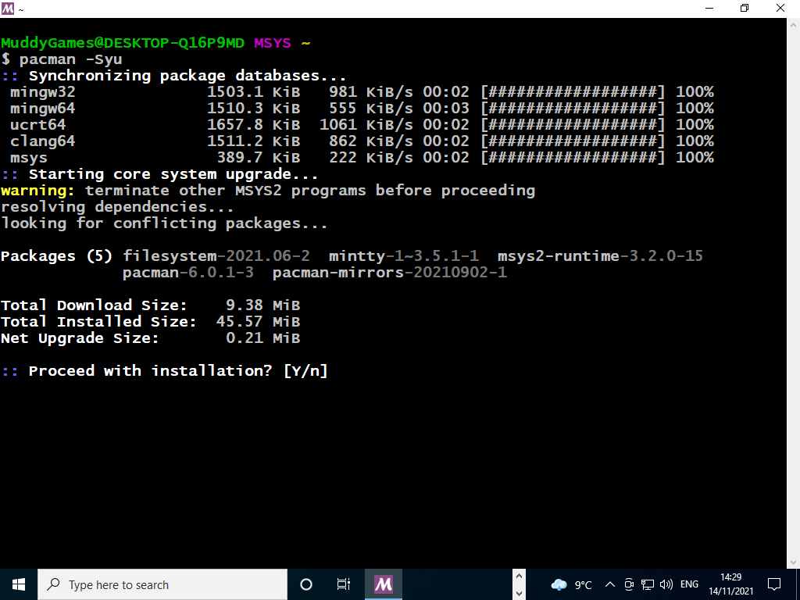
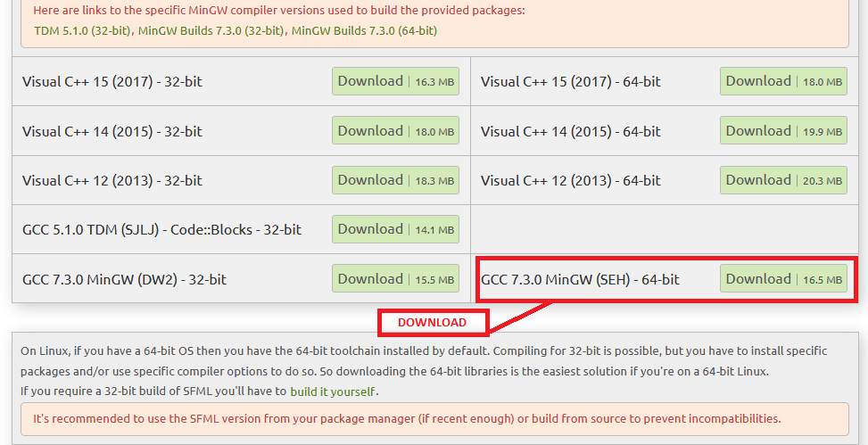
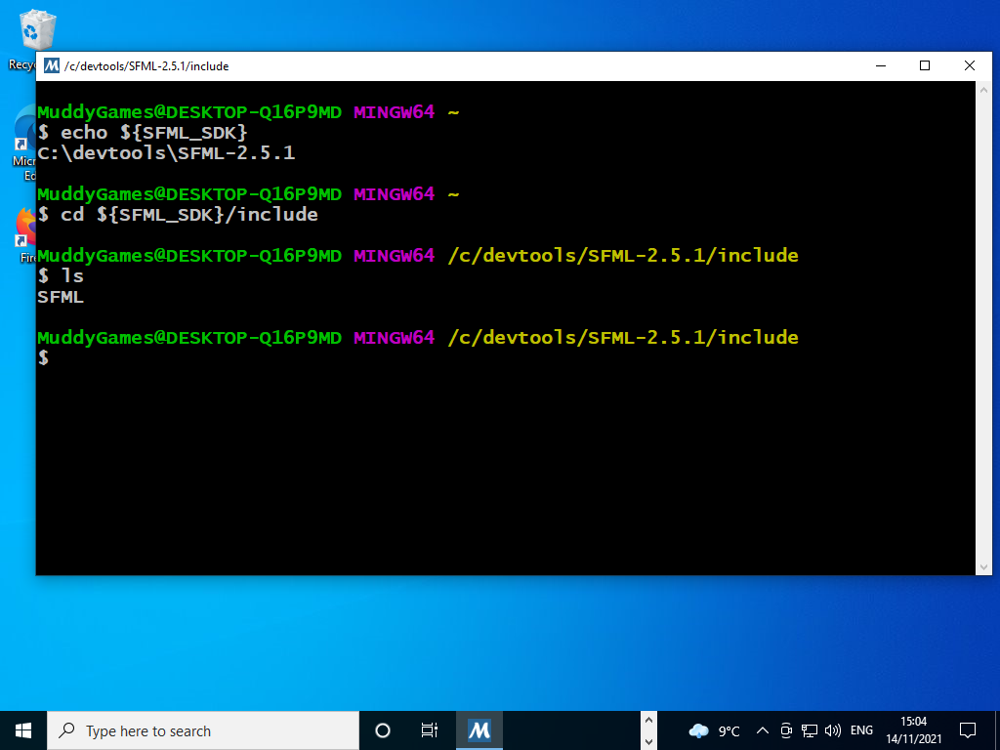

# README #
This project is a **Makefile** starter kit for SFML, this works on Linux
For windows the includes, libraries and paths will need to be set manually
SFML is not supported on Cgwin or MSys2 on Windows so it requires a custom install.

## Installation Linux
* Download Repository
* Install SFML on debian based distro using ```sudo apt-get install libsfml-dev```
* Navigate to root of project
* type ```make```

## Installation Windows
* Download and install [MSYS64](https://www.msys2.org/)
  
* Open MSYS Bash
    ** STEP 1 of Updating msys ```pacman -Syu``` this will shutdown bash when complete.
  
    ** STEP 2 of Updating msys after this has complete restart MSYS Bash and run ```pacman -Su```
 
* Open MSYS Bash and install 
    ** gcc ```pacman -S gcc```
     
    ** make ```pacman -S make```
     
    ** Install git ```pacman -S git```
     
    ** Install SFML ```pacman -S mingw-w64-x86_64-sfml```
     
* Download GCC 7.3.0 MinGW (SEH) - 64-bit from [SFML Website](https://www.sfml-dev.org/download/sfml/2.5.1/)
 
    ** Its good practice to place in `c:\devtools\SFML`
     
* Before proceeding to next step ensure your directory structure looks like image below
 
* Setup a Windows Environment Variable which points to where `GCC 7.3.0 MinGW (SEH) - 64-bit` is located
 
* Restart MSYS64 Bash and check that enviroment variable exists by typing `echo {SFML_SDK}` in terminal. Also check that you can see includes, libs and DLLs
 
* Create a directory e.g. `Projects` for repository, then `cd c:/Projects' and Clone repository
 
* Navigate to cloned project folder `sfml_game`
* type ```make```

## What is this repository for? ##
* Getting started with Visual Studio Code, SFML and Makefiles on Linux
* This is a great Tutorial to get this project running on [Windows](https://www.youtube.com/watch?v=Ljhpsdz8Ouo)

## Who do I talk to? ##
* philip.bourke@itcarlow.ie